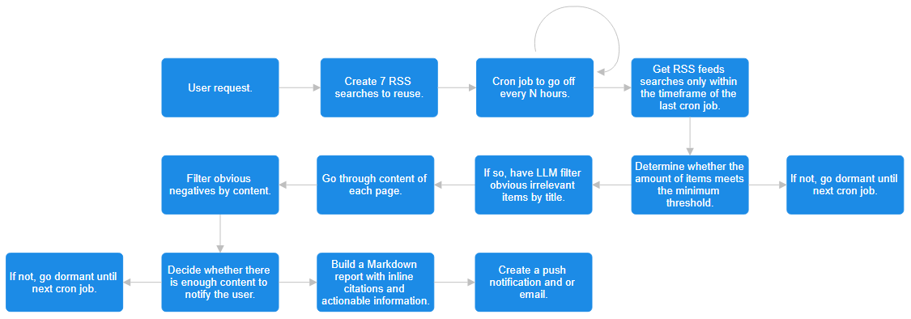

# Proactive AI

## Video

## Problem Statement

Normally, you have to message LLMs if you want information, such as up-to-date news. Recently, sites like ChatGPT have added features such as scheduling messages, where the AI sends you a message at a certain time. The issue with this is that these are always at a set time, and don't have custom triggers. But what if you want to know when something happens dynamically - something that isn't time dependent and isn't predictable?

Tools like Google Alerts aim to solve this problem by automatically detecting content and forwarding it to you - though this solution has three major flaws:

1. Every item is forwarded to you - whether it's relevant or not. There is no filtering of any kind - meaning users are overloaded with content!
2. It doesn't capture very many angles: you'd need to make many RSS filters, which lead to more unwanted content than stuff you want! Setting this up is time consuming, and requires lots of work to get it done right.
3. You are only sent links to content. This takes a lot of time to read, understand, and act upon. And most of the time the content isn't even relevant to you!

Current AIs are almost always reactive. For the few that are proactive, none are able to address all of these issues.

## Impact Statement

As humans, we’re drowning in irrelevant information. Our project turns LLMs from passive responders into dynamic agents, giving you back your time by filtering noise into signal, and delivering only what matters.

To do this, we used llama-4-scout (llama) with Cerebras API in order to get top-tier performance with near-instant generation. Llama autonomously monitors information online, *and* create actionable reports with it, all on its own. With reasoning, multi-step filtering, and more, it is able to determine when there is enough relevant information to proactively reach out to a user, making it easier to get information you need to have without being online 24/7. Then, once it gathers enough information, it builds a report with citations and specific info that directly ties back into the user's query.

This allows for you to find out about dynamic things, such as but not limited to:
- Breaking news
- New job postings
- Track updates on games or software
- Notify you when something is trending
- And more!

This content is sent right to you through email, so you get the info when it's relevant, not days later. To be clear: this isn't a chatbot. It's an agent that is persistent, proactive, and asynchronous. A report could come at noon or midnight, because it never stops working for you.

## Explanation

### Step 1 - Setup

First, we take in the user's request. Immediately, llama creates 7 RSS searches designed to capture different angles of the query. This way, we get more coverage of articles and less duplicates.

We set up a cron job to periodically check for new content.

### Step 2 - First Pass

Every time the cron job runs, we get a list of new RSS items. After deduplication, we then use the llama to filter out only obviously irrelevant items, avoiding false negatives. This way, we can save tokens while having a lower risk of losing important content.

If the amount of accepted items is greater than a certain amount, we can proceed to the next step.

### Step 3 - Deep Pass

Now, with the list of items that passed the first filter, we can evaluate them under the second filter. This time, we *do* use the contents of the webpage in the llama call. Llama either filters out the item, or creats a 200 word summary with important details that are specifically mentioned. This is important for Step 4.

If we do not have enough content at this step to meet the minimum set by the user, these summaries are saved to add to the count of the next cron job.

### Step 4 - Narrative

Once we have all of our items that passed both filters, we can format them into one call. We send llama the following information per item:
- The title of the item.
- The link of the item (and therefore the source website).
- The date it was published.
- The previously generated information from Step 3.

Now, llama can create a narrative report, citing all information and providing specific information - instead of a dump of links, it synthesizes, cites, and contextualizes information in human-readable form. With Cerebras, we're able to speed up the generation time to get reports out timely - our process which takes ~ 60 seconds total in entirety could take 10 minutes without Cerebras.

Finally, the user is then notified that their report is waiting for them!